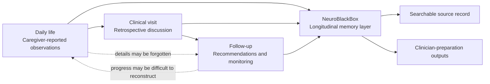
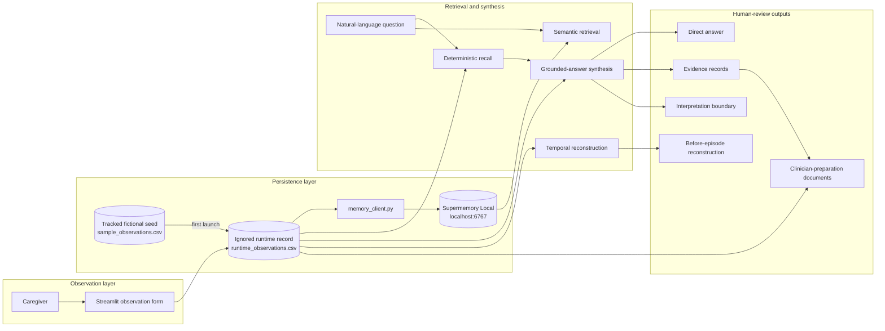
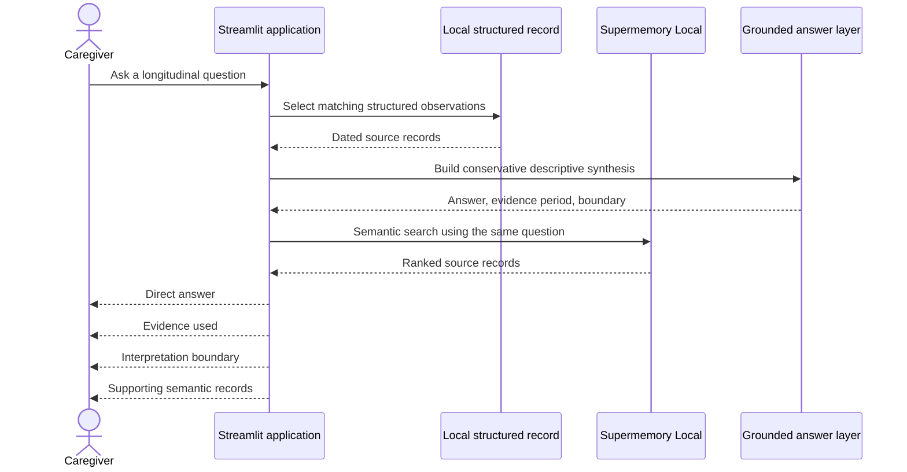
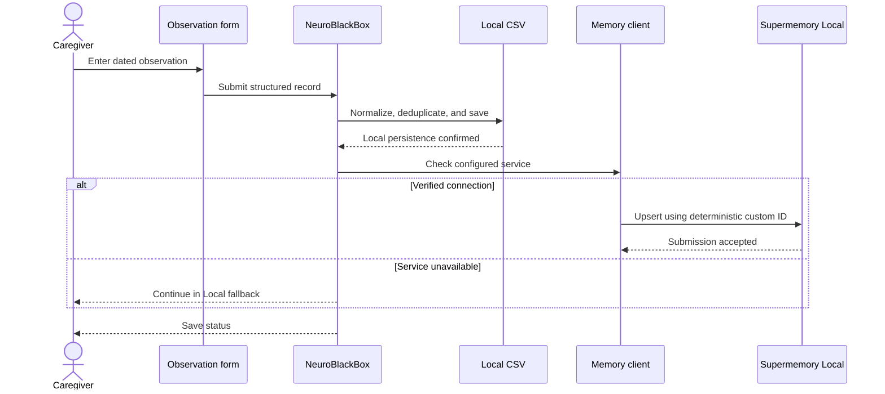

<div align="center">

# NeuroBlackBox

### A longitudinal memory layer for cognitive-care observations

NeuroBlackBox preserves caregiver-reported observations across the interval between clinical visits, then turns that history into grounded answers, temporal reconstructions, and clinician-preparation documents.

<br>

[](https://www.python.org/)
[](https://streamlit.io/)
[](https://supermemory.ai/)
[](https://pandas.pydata.org/)
[](#prototype-status)
[](#research-and-safety-boundary)

<br>

[Problem](#the-continuity-problem) ·
[System](#system-overview) ·
[Architecture](#system-architecture) ·
[Prototype](#working-prototype) ·
[Quickstart](#run-locally) ·
[Safety](#research-and-safety-boundary)

</div>

---

## Thesis

> **Care does not end when the appointment does.**

Important cognitive-care context is generated during ordinary life: a longer pause while recalling a familiar name, a repeated question, a disrupted routine, a medication-related observation, an improvement, or a significant episode.

That context is often compressed into one retrospective conversation during the next clinical visit.

NeuroBlackBox creates a persistent, searchable record across that interval so families and clinicians do not have to reconstruct weeks or months of change from memory alone.

The prototype is built around three principles:

1. **Preserve the original observation.**
2. **Answer questions from recorded evidence.**
3. **Keep every interpretation bounded and inspectable.**

---

## The continuity problem

Families and caregivers may notice meaningful changes every day, but those observations are often distributed across memory, text messages, notebooks, and conversations.

By the time a clinical appointment occurs, the available history may be reduced to:

> Something feels different.

That statement may be important, but it is not a structured interval history.

NeuroBlackBox converts fragmented recollection into dated, inspectable records:

```text
Jun 22  Routine       Left the tea kettle on after leaving the kitchen.
Jun 25  Repetition    Repeated whether her son had called five times.
Jun 28  Speech        Longer pauses while searching for simple words.
Jun 30  Episode       Evening confusion involving the medication box.
```

The objective is not to infer a diagnosis. The objective is to preserve enough context for a more informed human conversation.



---

## What NeuroBlackBox demonstrates

| Capability | Prototype implementation |
|---|---|
| Observation capture | Structured Streamlit input for dated caregiver observations |
| Transparent persistence | Ignored runtime CSV initialized from an immutable synthetic seed |
| Semantic memory | Health-gated Supermemory reconciliation using deterministic record IDs |
| Question answering | Conservative deterministic synthesis from recorded evidence |
| Evidence retrieval | Ranked semantic source records from Supermemory Local |
| Temporal reconstruction | Review of observations preceding a selected high-severity episode |
| Longitudinal summaries | Thirty-day observation brief |
| Clinical preparation | Downloadable caregiver-clinician preparation document |
| Failure tolerance | Verified Online status or deterministic Local fallback |
| Safety framing | Explicit limits around diagnosis, prediction, causation, and treatment |

---

## Working prototype

The prototype supports four connected workflows.

### 1. Record

A caregiver enters a direct observation with:

- observation date
- category
- recorded severity
- source
- free-text evidence

### 2. Remember

The observation is written to the ignored local runtime record. When the
Supermemory health probe succeeds, it is also reconciled into the configured
semantic-memory container using a deterministic ID.

- local persistence remains available if Supermemory is offline
- resubmitting the same exact record does not create a duplicate

### 3. Ask

The caregiver can ask questions such as:

```text
How have repeated questions changed?
```

```text
Are speech pauses increasing?
```

```text
What was observed before the latest high-severity episode?
```

```text
What should we discuss with the clinician?
```

### 4. Prepare

The system produces:

- a direct grounded answer
- an evidence period
- the dated observations used
- an interpretation boundary
- semantic source records
- a before-episode reconstruction
- a thirty-day observation brief
- a caregiver-clinician preparation summary

---

## Grounded-answer model

NeuroBlackBox does not present retrieved text as an unexplained search result.

Each response is organized into three layers.

### Answer

A concise response to the question using the structured local record.

### Evidence

The dated source observations used to support the response.

### Boundary

A statement clarifying what the evidence does and does not establish.

Example:

```text
QUESTION
How have repeated questions changed?

ANSWER
Five repetition-related observations were recorded between Jun 13 and Jul 09.
More matching observations occurred in the later half of the review period.
The record includes one high-severity repetition observation.

EVIDENCE
Jun 13 — Asked the same appointment question three times.
Jun 25 — Asked whether her son had called five times.
Jul 09 — Asked about dinner three times in thirty minutes.

BOUNDARY
Frequency in the log may reflect both lived events and caregiver recording behavior.
The record does not independently establish diagnosis or disease progression.
```

This answer layer is deliberately conservative. It summarizes the record without converting semantic similarity or temporal proximity into a medical claim.

---

## System overview

NeuroBlackBox uses a dual-path memory design.

### Structured path

The local CSV provides:

- transparent persistence
- deterministic filtering
- temporal ordering
- interpretable category counts
- reproducible fallback behavior

### Semantic path

Supermemory Local provides:

- memory across sessions
- semantic retrieval
- source-record ranking
- natural-language access to longitudinal context
- container-scoped memory separation

The two paths are complementary.

The CSV is the inspectable structured record. Supermemory is the semantic retrieval layer.

---

## System architecture



---

## Query lifecycle



---

## Write lifecycle



---

## Code architecture

The prototype intentionally keeps the runtime surface small.

### `src/app.py`

The main application contains the product interface and the complete local analysis workflow.

```text
src/app.py
├── application configuration
│   ├── page metadata
│   ├── observation schema
│   ├── categories
│   └── severity levels
│
├── generic utilities
│   ├── HTML escaping
│   ├── direct HTML rendering
│   └── empty-frame construction
│
├── data access
│   ├── synthetic seed-to-runtime initialization
│   ├── runtime CSV loading
│   ├── schema normalization
│   ├── exact-record deduplication
│   ├── date parsing
│   ├── local persistence
│   └── Streamlit cache invalidation
│
├── descriptive analysis
│   ├── category counts
│   ├── severity counts
│   ├── keyword mentions
│   ├── thirty-day windows
│   └── high-severity episode selection
│
├── temporal reconstruction
│   ├── before-episode window selection
│   ├── source-record ordering
│   ├── descriptive signal counts
│   └── causal-inference boundary
│
├── generated documents
│   ├── thirty-day observation brief
│   ├── before-episode reconstruction
│   └── caregiver-clinician preparation summary
│
├── deterministic retrieval
│   ├── question-intent matching
│   ├── category filtering
│   ├── text-pattern filtering
│   └── local fallback recall
│
├── grounded question answering
│   ├── record deduplication
│   ├── evidence-period calculation
│   ├── early-versus-late distribution
│   ├── question-specific synthesis
│   ├── evidence selection
│   └── interpretation boundaries
│
├── Supermemory result handling
│   ├── response-shape normalization
│   ├── relevance-score extraction
│   ├── source-content cleaning
│   └── evidence-card rendering
│
├── session state
│   ├── query presets
│   ├── save status
│   ├── health-probe state
│   ├── signature-gated memory reconciliation
│   └── rerun behavior
│
└── product interface
    ├── research-oriented landing page
    ├── continuity-gap explanation
    ├── system architecture presentation
    ├── live memory console
    ├── observation form
    ├── source table
    ├── report views
    └── research and safety boundary
```

### `src/memory_client.py`

The memory adapter isolates Supermemory-specific behavior from the application.

```text
src/memory_client.py
├── environment loading
├── endpoint configuration
├── API-key configuration
├── container-tag configuration
├── Supermemory client initialization
├── bounded read-only connection probe
├── deterministic custom-ID generation
├── observation serialization
├── idempotent semantic-memory writes
├── runtime-record reconciliation
├── semantic search
├── result normalization
└── sanitized failure reporting
```

This separation allows the Streamlit application to retain deterministic local behavior even when the semantic-memory service is unavailable.

---

## Data architecture

`data/sample_observations.csv` is a wholly fictional, synthetic, immutable
seed used only to initialize a first-run local record. The application never
writes caregiver entries to the tracked seed. On first launch it creates
`data/runtime_observations.csv`; all runtime entries are saved there, and that
file is ignored by Git. Exact duplicate records are suppressed during
normalization.

Each source observation follows a small interpretable schema.

| Field | Purpose | Example |
|---|---|---|
| `date` | When the observation occurred | `2026-06-25` |
| `type` | Observation category | `repetition` |
| `severity` | Caregiver-recorded priority | `high` |
| `source` | Origin of the observation | `caregiver` |
| `observation` | Direct free-text evidence | `Repeated whether her son had called five times.` |

Example row:

```csv
date,type,severity,source,observation
2026-06-25,repetition,high,caregiver,Repeated question about whether son had called five times in one afternoon.
```

The schema is intentionally small so that:

- every record remains inspectable
- filtering remains deterministic
- summaries can cite original evidence
- the prototype does not hide meaning inside an opaque score

---

## Memory architecture

The ignored runtime CSV is the canonical local record. When Supermemory Local
passes its health probe, session reconciliation projects each runtime record
into the configured container using a deterministic custom ID. The same exact
record resolves to the same semantic-memory ID instead of creating another
copy. When the service is unavailable, the app remains usable in Local
fallback.

### Local structured record

```text
date
type
severity
source
observation
```

### Semantic-memory representation

```text
NeuroBlackBox caregiver observation.
Date: 2026-06-25.
Type: repetition.
Severity: high.
Source: caregiver.
Observation: Repeated question about whether son had called five times in one afternoon.
```

The semantic representation improves natural-language retrieval while preserving the underlying source text.

A container tag scopes the memory used by this prototype:

```text
NEUROBLACKBOX_CONTAINER=neuroblackbox_demo_patient_eleanor_v2
```

The `v2` suffix creates a clean release-demo namespace. Existing data in an
older container is isolated and is not deleted.

For a production system, container design would require a formal identity, authorization, tenancy, and data-governance model.

---

## Why Supermemory Local

A conventional search interface can retrieve exact keywords. Cognitive-care observations are often described inconsistently across time.

For example:

```text
Could not remember the neighbor's name.
```

```text
Long pauses while searching for a familiar word.
```

```text
Used “that person next door” instead of the name.
```

These observations may be related even when they do not share identical wording.

Supermemory Local gives the prototype:

- persistent memory across sessions
- semantic retrieval over caregiver language
- ranked source observations
- natural-language access to longitudinal context
- local execution for a privacy-sensitive prototype
- a clean boundary between memory infrastructure and application logic

NeuroBlackBox still maintains a deterministic CSV fallback because semantic retrieval can be incomplete or unavailable.

---

## Before-episode reconstruction

The temporal-reconstruction workflow:

1. identifies the latest observation categorized as:
   - `type = episode`
   - `severity = high`
2. selects records from a fixed period before that episode
3. orders the records by date
4. reports descriptive category counts
5. presents the original source observations
6. states that temporal proximity does not establish prediction or causation

Example:

```text
Index episode
Jun 30, 2026

Review interval
Jun 20, 2026 – Jun 30, 2026

Source observations
Jun 22 — Routine: Left the tea kettle on after leaving the kitchen.
Jun 25 — Repetition: Asked whether her son had called five times.
Jun 28 — Speech: Longer pauses while searching for simple words.
```

The output reconstructs the source record before an event without making a
predictive claim.

**These observations were recorded before the episode.** Temporal proximity
does not establish prediction or causation.

---

## Clinician-preparation outputs

The prototype generates three downloadable Markdown documents.

### Thirty-day observation brief

Summarizes:

- total observations
- category composition
- recorded severity
- pause or word-finding mentions
- repetition-related mentions
- interpretation limits

### Before-episode reconstruction

Summarizes:

- index episode
- review interval
- descriptive signals
- source observations
- temporal-inference boundary

### Caregiver-clinician preparation summary

Summarizes:

- observation period
- category totals
- high-severity source records
- recent source records
- questions for clinical discussion
- safety boundary

These documents support preparation and continuity. They are not formal medical records.

---

## Repository structure

```text
neuroblackbox/
├── data/
│   ├── sample_observations.csv
│   │   Immutable fictional synthetic seed
│   └── runtime_observations.csv
│       Generated local record (ignored by Git)
│
├── docs/
│   ├── demo_script.md
│   │   Three-minute product demonstration flow
│   │
│   ├── hackathon_submission.md
│   │   Submission framing and project summary
│   │
│   ├── product_thesis.md
│   │   Problem definition and product rationale
│   │
│   └── safety_positioning.md
│       Medical-safety language and product boundaries
│
├── src/
│   ├── app.py
│   │   Streamlit interface, analysis, grounded answers, and reports
│   │
│   └── memory_client.py
│       Supermemory Local adapter
│
├── tests/
│   └── test_release_hardening.py
│       Data, memory-adapter, and Streamlit regression tests
│
├── .env.example
├── .gitignore
├── README.md
└── requirements.txt
```

Local backup files are intentionally excluded from version control.

---

## Technology stack

| Layer | Technology |
|---|---|
| Product interface | Streamlit |
| Application language | Python |
| Structured data operations | Pandas |
| Semantic-memory layer | Supermemory Local |
| Deterministic persistence | CSV |
| Configuration | `python-dotenv` |
| Download format | Markdown |

Pinned runtime dependencies are listed in `requirements.txt`.

Key versions used by the prototype:

```text
Python          3.12+
Streamlit       1.59.1
Pandas          3.0.3
Supermemory SDK 3.50.0
```

---

## Run locally

### Prerequisites

Install:

- Python 3.12 or newer
- Node.js and `npx`
- Git

### 1. Clone the repository

```bash
git clone git@github.com:Vedangalle/neuroblackbox.git
cd neuroblackbox
```

### 2. Create the Python environment

```bash
python3 -m venv .venv
source .venv/bin/activate
pip install -r requirements.txt
```

### 3. Configure the environment

Copy the safe configuration template:

```bash
cp .env.example .env
```

Confirm these values in the ignored `.env`:

```dotenv
SUPERMEMORY_API_URL=http://localhost:6767
SUPERMEMORY_API_KEY=local
NEUROBLACKBOX_CONTAINER=neuroblackbox_demo_patient_eleanor_v2
```

Use the local key provided by your Supermemory Local setup.

The `v2` tag is a clean fictional demo namespace. Changing container tags
isolates old memory; it does not delete it.

Do not commit `.env` or expose its contents.

### 4. Start Supermemory Local

Use a dedicated terminal:

```bash
npx supermemory local
```

Keep this process running.

The expected local endpoint is:

```text
http://localhost:6767
```

### 5. Start NeuroBlackBox

Open a second terminal:

```bash
cd neuroblackbox
source .venv/bin/activate
streamlit run src/app.py
```

Open:

```text
http://localhost:8501
```

On first launch, the app copies the immutable synthetic seed into the ignored
runtime record. It reports `Supermemory: Online` only after a real read-only
service probe succeeds; otherwise it remains fully usable in `Local fallback`.

### 6. Run the release preflight

In the NeuroBlackBox project terminal:

```bash
python -m unittest discover -s tests -v
git check-ignore -v data/runtime_observations.csv
git diff --check
```

Do not claim semantic storage during a demo unless the interface reports
`Supermemory: Online`.

---

## Runtime topology

NeuroBlackBox uses three local processes or resources:

```text
Browser
  │
  ▼
Streamlit application
localhost:8501
  │
  ├── Synthetic seed (tracked, read-only)
  │   data/sample_observations.csv
  │          │ first launch
  │          ▼
  ├── Runtime record (ignored, read/write)
  │   data/runtime_observations.csv
  │          │ health-gated reconciliation
  │          ▼
  └── Supermemory Local (when verified Online)
      localhost:6767
```

---

## Recommended demo

A complete demo can be delivered in approximately three minutes.

### 0:00–0:25 — Problem

Explain that meaningful changes occur between appointments and are difficult to reconstruct later.

### 0:25–0:50 — Product thesis

Show the landing page and the longitudinal-memory architecture.

### 0:50–1:15 — Record

Add one direct caregiver observation.

Exact-record deduplication and deterministic memory IDs make the scripted
entry repeat-safe. For a completely clean semantic demonstration, choose a
fresh container suffix; old container data remains isolated and is not
deleted.

### 1:15–1:55 — Ask

Ask:

```text
How have repeated questions changed?
```

Show:

- direct answer
- evidence period
- evidence used
- interpretation boundary
- Supermemory source records

### 1:55–2:25 — Reconstruct

Show the observations recorded before the latest high-severity episode.

### 2:25–2:45 — Prepare

Show and download the clinician-preparation summary.

### 2:45–3:00 — Architecture

Explain:

> Supermemory Local provides persistent semantic recall across sessions, while the local structured record keeps the workflow inspectable and deterministic.

A longer walkthrough is available in [`docs/demo_script.md`](docs/demo_script.md).

---

## Research and safety boundary

NeuroBlackBox is an observation-organization and clinician-preparation prototype.

It does **not**:

- diagnose Alzheimer’s disease
- diagnose dementia
- screen for a medical condition
- predict future episodes
- estimate clinical risk
- establish disease progression
- infer causation
- recommend treatment
- replace a clinician
- replace an official medical record

### Caregiver-entered evidence

The system cannot independently verify whether an observation is complete, representative, or consistently interpreted.

### No causal inference

An observation occurring before an episode does not establish that it caused or predicted the episode.

### No clinical validation

The prototype has not undergone clinical validation, regulatory review, or medical-device assessment.

### Retrieval can be incomplete

Semantic search may omit relevant records or retrieve records that are only weakly related to the question.

### Recording behavior affects counts

A greater number of recorded events may reflect:

- a real change
- more frequent caregiver logging
- duplicate entry
- changed wording
- changed observation context

### Human review remains essential

Families and qualified clinicians must review the source records and determine whether further evaluation is appropriate.

See [`docs/safety_positioning.md`](docs/safety_positioning.md) for the full safety rationale.

---

## Design decisions

### Why not generate a diagnosis?

The source data is caregiver-entered, incomplete, and unvalidated. Diagnostic inference would exceed what the evidence can support.

### Why show source records?

A summary without evidence is difficult to inspect. NeuroBlackBox keeps the dated observations visible beneath the answer.

### Why maintain CSV fallback?

The structured record provides transparent, deterministic behavior if semantic search is unavailable or incomplete.

### Why use bounded synthesis?

The system answers the user’s question while explicitly separating:

- observation
- summary
- temporal relationship
- clinical interpretation

### Why local-first?

Cognitive-care observations can contain sensitive family, behavioral, medication, and routine information. The prototype demonstrates a workflow in which the memory service and structured record run locally.

---

## Prototype status

### Complete

- [x] Research-oriented product website
- [x] Structured observation capture
- [x] Local CSV persistence
- [x] Immutable synthetic seed and ignored runtime record
- [x] Exact-record deduplication
- [x] Supermemory Local write integration
- [x] Health-probed Online/Local fallback state
- [x] Idempotent startup/session reconciliation
- [x] Supermemory Local semantic search
- [x] Deterministic retrieval fallback
- [x] Grounded direct-answer layer
- [x] Evidence-period reporting
- [x] Source-observation display
- [x] Repetition-pattern questions
- [x] Speech and word-finding questions
- [x] Before-episode reconstruction
- [x] Thirty-day observation brief
- [x] Caregiver-clinician preparation summary
- [x] Downloadable Markdown reports
- [x] Research and safety boundaries
- [x] Responsive vendor-facing interface
- [x] Built-in release-hardening regression tests

### Hackathon hardening

- [ ] Add final product screenshots
- [ ] Run complete clean-machine setup test
- [ ] Record final three-minute demo
- [ ] Verify every preset question
- [ ] Verify write, retrieval, and report-download flows

---

## Future research directions

Potential extensions include:

- multi-caregiver records
- explicit clinical-visit objects
- recommendation tracking across appointments
- intervention and outcome linking
- voice-note ingestion
- speech-to-text observation capture
- multilingual caregiver input
- reminder-assisted observation logging
- configurable review windows
- longitudinal visualizations
- provenance-aware report generation
- role-based access
- encrypted storage architecture
- clinician-reviewed terminology mapping
- formal usability studies
- clinical validation research

These are future directions, not current prototype claims.

---

## Project documentation

| Document | Purpose |
|---|---|
| [`docs/product_thesis.md`](docs/product_thesis.md) | Product rationale and continuity-gap thesis |
| [`docs/safety_positioning.md`](docs/safety_positioning.md) | Safety language and prohibited claims |
| [`docs/demo_script.md`](docs/demo_script.md) | End-to-end demonstration flow |
| [`docs/hackathon_submission.md`](docs/hackathon_submission.md) | Submission-ready project framing |

---

## Built for Supermemory Local

NeuroBlackBox was developed as a local-first memory prototype using Supermemory Local.

Supermemory is used as the persistent semantic-retrieval layer. The application-specific contribution is the cognitive-care observation model, conservative grounded-answer workflow, temporal reconstruction, evidence presentation, and clinician-preparation interface.

---

## License and use

This repository is a hackathon research prototype.

It is not intended for clinical deployment, emergency use, diagnosis, treatment selection, or unsupervised medical decision-making.

---

<div align="center">

### Every appointment should begin with context, not reconstruction.

Built with Python, Streamlit, Pandas, and Supermemory Local.

</div>
